PostGIS raster stores the relationship between raster cell coordinates
`(i, j)` and spatial coordinates `(x, y)` as the same six-coefficient
geotransform used by GDAL world files:

```text
x = upperleftx + scalex * i + skewx * j
y = upperlefty + skewy  * i + scaley * j
```

The same coefficients appear in `ST_GeoReference` output as `scalex`,
`skewy`, `skewx`, `scaley`, `upperleftx`, and `upperlefty`. In C, the raster
core exposes them as `scaleX`, `skewX`, `skewY`, `scaleY`, `ipX`, and `ipY`;
see `rt_raster_get_geotransform_matrix()` and
`rt_raster_set_geotransform_matrix()` in `raster/rt_core/rt_raster.c`.

The old `DevWikiAffineParameters` page is still useful because it explains how
the four linear coefficients can be derived from more physical raster-grid
descriptors. The reverse derivation is covered in
[Raster physical georeferencing parameters](raster-physical-parameters.md).

* `i_mag`: size of one pixel step along the transformed `i` axis.
* `j_mag`: size of one pixel step along the transformed `j` axis.
* `theta_i`: clockwise rotation from the spatial x axis to the transformed
  `i` basis vector.
* `theta_ij`: counterclockwise angle from the transformed `i` basis vector to
  the transformed `j` basis vector.

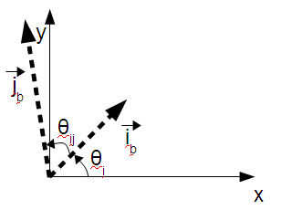

The current code still uses these descriptors. `rt_raster_calc_gt_coeff()`
computes `xscale`, `xskew`, `yskew`, and `yscale` from them.
`rt_raster_calc_phys_params()` performs the reverse calculation.
`RASTER_setRotation()` preserves `i_mag`, `j_mag`, and `theta_ij` while
changing `theta_i`. `RASTER_setGeotransform()` accepts the physical
descriptors and writes the resulting scale and skew coefficients.

## Elementary transforms

The derivation uses ordinary two-dimensional linear transforms. These are not
complete affine transforms until the upper-left offsets are added, but they
make the scale, skew, and rotation terms easier to reason about.

Counterclockwise rotation:

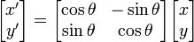

```text
x' = x cos(theta) - y sin(theta)
y' = x sin(theta) + y cos(theta)
```

Clockwise rotation:

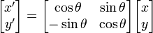

```text
x' = x cos(theta) + y sin(theta)
y' = -x sin(theta) + y cos(theta)
```

Scaling:

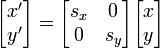

```text
x' = x * s_x
y' = y * s_y
```

Shearing parallel to the x axis:

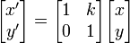

```text
x' = x + k_x * y
y' = y
```

Shearing parallel to the y axis:

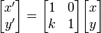

```text
x' = x
y' = k_y * x + y
```

Reflection across the x axis:

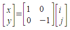

```text
x' = x
y' = -y
```

## Combining transforms

The derivation used by PostGIS combines:

1. Reflection across the `i` axis.
2. Scaling along the `i` and `j` axes.
3. Shearing parallel to the `i` axis.
4. Clockwise rotation by `theta_i`.

The aggregate matrix `O` is the product of those matrices:

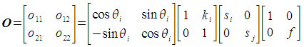

The intermediate products are:

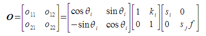

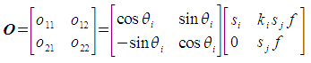

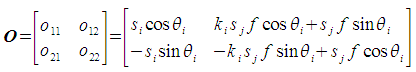

The result is:

```text
o11 = s_i * cos(theta_i)
o12 = k_i * s_j * f * cos(theta_i) + s_j * f * sin(theta_i)
o21 = -s_i * sin(theta_i)
o22 = -k_i * s_j * f * sin(theta_i) + s_j * f * cos(theta_i)
```

The coefficients are mixed terms. None of them represents pure scale,
rotation, or skew once the operations are combined.

The matrix is then applied to raster cell coordinates as:

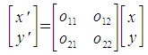

```text
x' = o11 * i + o12 * j
y' = o21 * i + o22 * j
```

## Calculating terms

The reflection flag `f` records whether the transformed `j` axis is flipped:

```text
if theta_ij < 0 then f = -1
if theta_ij >= 0 then f = 1
```

The `i` basis vector is:

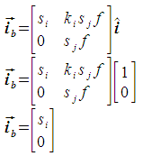

Its magnitude is:

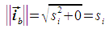

So:

```text
s_i = i_mag
```

The `j` basis vector is:

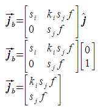

The shear angle is the complement of `theta_ij`, with the reflection flag
included so one expression works for flipped and unflipped grids:

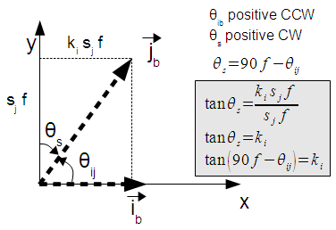

```text
k_i = tan(f * pi / 2 - theta_ij)
```

This gives `k_i = 0` when `theta_ij` is 90 degrees or -90 degrees. A
`theta_ij` of 0 or pi is invalid because the transformed basis vectors would
be parallel and the grid would collapse.

The `j` basis vector magnitude is:

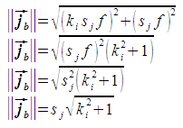

Solving for `s_j` gives:

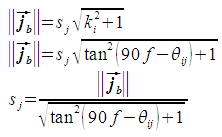

```text
s_j = j_mag / sqrt(k_i * k_i + 1)
```

## Affine matrix storage

The 2-by-2 matrix `O` becomes the upper-left part of the full affine matrix
`A`. The upper-right column stores translation, and the bottom row is fixed:

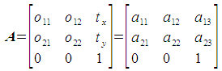

The cell-to-world conversion is:

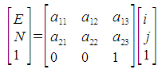

```text
x = a11 * i + a12 * j + a13
y = a21 * i + a22 * j + a23
```

PostGIS raster stores those six changeable coefficients as:

| Affine coefficient | Raster field |
|--------------------|--------------|
| `a11` | `ScaleX` / `scaleX` |
| `a12` | `SkewX` / `skewX` |
| `a13` | `UpperLeftX` / `ipX` |
| `a21` | `SkewY` / `skewY` |
| `a22` | `ScaleY` / `scaleY` |
| `a23` | `UpperLeftY` / `ipY` |

For the general affine case, the names `ScaleX`, `ScaleY`, `SkewX`, and
`SkewY` are conventional storage names rather than proof that a coefficient is
pure scale or pure skew.

## Current code anchors

The current implementation points to the same model:

* `rt_raster_calc_gt_coeff()` in `raster/rt_core/rt_raster.c` implements the
  physical-parameter-to-coefficient equations above.
* `rt_raster_calc_phys_params()` computes `i_mag`, `j_mag`, `theta_i`, and
  `theta_ij` from the four linear geotransform coefficients.
* `rt_raster_set_phys_params()` applies the calculated scale and skew
  coefficients while leaving upper-left offsets unchanged.
* `RASTER_setRotation()` in `raster/rt_pg/rtpg_raster_properties.c` preserves
  the current physical pixel sizes and basis-vector separation while changing
  only the rotation angle.
* `ST_SetScale`, `ST_SetSkew`, `ST_SetRotation`, `ST_ScaleX`, `ST_ScaleY`,
  `ST_SkewX`, `ST_SkewY`, and `ST_GeoReference` remain the documented SQL
  entry points for inspecting or changing the stored georeference metadata.
