PostGIS raster stores georeferencing as six affine coefficients, but some SQL
and C entry points expose a more physical model:

* `i_mag`: pixel size along the transformed raster column axis.
* `j_mag`: pixel size along the transformed raster row axis.
* `theta_i`: clockwise rotation from the spatial x axis to the transformed
  `i` basis vector.
* `theta_ij`: signed angular separation from the transformed `i` basis vector
  to the transformed `j` basis vector.
* `xoffset` and `yoffset`: translation to the raster upper-left corner.

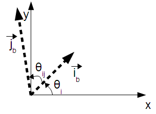

The historical `DevWikiRealParameters` page describes how to derive those
physical terms from the four non-translation affine coefficients. This is the
reverse direction of [raster affine georeferencing](raster-affine.md), which
derives stored scale and skew coefficients from physical parameters.

Current code still implements this reverse calculation in
`rt_raster_calc_phys_params()` in `raster/rt_core/rt_raster.c`. The SQL-visible
`ST_Geotransform` path uses the same calculation through
`RASTER_getGeotransform()` in `raster/rt_pg/rtpg_raster_properties.c`.

## Stored Coefficients

The stored cell-to-world transform is:

```text
x = upperleftx + scalex * i + skewx * j
y = upperlefty + skewy  * i + scaley * j
```

The old derivation names the four linear coefficients as `o11`, `o12`, `o21`,
and `o22`:

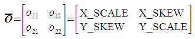

PostGIS maps those names to raster fields as:

| Derivation term | Raster field |
|-----------------|--------------|
| `o11` | `scaleX` / `ST_ScaleX` |
| `o12` | `skewX` / `ST_SkewX` |
| `o21` | `skewY` / `ST_SkewY` |
| `o22` | `scaleY` / `ST_ScaleY` |

For a general affine transform, these fields are storage names. `scaleX` and
`scaleY` are not necessarily pure pixel width and height once rotation or skew
is present.

## Pixel Sizes

The transformed `i` basis vector comes from applying the linear transform to a
unit step in raster column coordinates:

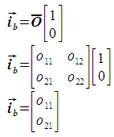

Its length is the physical pixel size along the `i` direction:

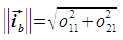

In current C code:

```text
i_mag = sqrt(scaleX * scaleX + skewY * skewY)
```

The transformed `j` basis vector is the same calculation for a unit row step:

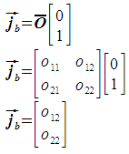

Its length is:

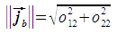

In current C code:

```text
j_mag = sqrt(skewX * skewX + scaleY * scaleY)
```

These magnitudes are the values preserved by `ST_SetRotation` when changing
only raster rotation.

## Rotation Angle

`theta_i` is the clockwise angle from the spatial x axis to the transformed
`i` basis vector:

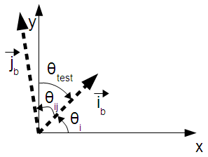

The magnitude is calculated with a dot-product form:

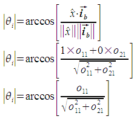

In current C code:

```text
theta_i = acos(scaleX / i_mag)
```

The sign is chosen by comparing the transformed `i` basis vector with the
spatial y axis:

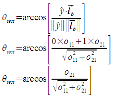

In current C code:

```text
theta_test = acos(skewY / i_mag)
if theta_test < pi / 2:
    theta_i = -theta_i
```

The old Trac page describes the sign test in degrees. The implementation uses
radians throughout, because the C math functions return radians and
`ST_SetRotation` stores the incoming rotation as the same `theta_i` value.

## Basis Vector Separation

`theta_ij` is the signed angle from the transformed `i` basis vector to the
transformed `j` basis vector:

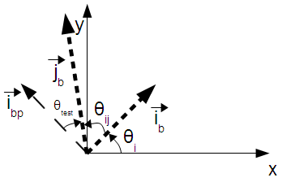

The magnitude is:

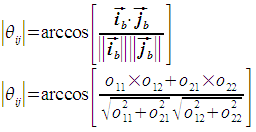

In current C code:

```text
theta_ij = acos(
    (scaleX * skewX + skewY * scaleY) / (i_mag * j_mag)
)
```

The sign is tested against `i_bp`, the vector perpendicular to `i_b` after a
counterclockwise quarter-turn:

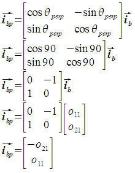

The old derivation expresses the sign test as:

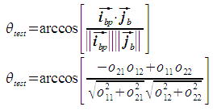

In current C code:

```text
theta_test = acos(
    (-skewY * skewX + scaleX * scaleY) / (i_mag * j_mag)
)
if theta_test > pi / 2:
    theta_ij = -theta_ij
```

A `theta_ij` value of 90 degrees or -90 degrees means the transformed basis
vectors are orthogonal. Other values represent skewed or diamond-shaped cells.
`rt_raster_calc_gt_coeff()` rejects `theta_ij` values of `0` and `pi` when
going the other direction, because the basis vectors would be parallel and the
grid would collapse.

## Current Code Anchors

The active implementation is split across the raster core and SQL wrapper
layers:

* `rt_raster_get_phys_params()` reads the four stored linear coefficients and
  calls `rt_raster_calc_phys_params()`.
* `rt_raster_calc_phys_params()` computes `i_mag`, `j_mag`, `theta_i`, and
  `theta_ij` from `scaleX`, `skewX`, `skewY`, and `scaleY`.
* `rt_raster_set_phys_params()` calls `rt_raster_calc_gt_coeff()` to convert
  physical terms back to stored coefficients.
* `RASTER_getGeotransform()` uses `rt_raster_calc_phys_params()` for the
  SQL-visible `ST_Geotransform` physical-parameter record.
* `RASTER_setGeotransform()` accepts `imag`, `jmag`, `theta_i`, `theta_ij`,
  `xoffset`, and `yoffset`, then stores the corresponding affine coefficients
  and offsets.
* `RASTER_setRotation()` preserves `i_mag`, `j_mag`, and `theta_ij` while
  changing `theta_i`.

When debugging raster alignment, reskewing, or rotation behavior, keep both
representations in view: SQL users see scale and skew metadata, while the
internals may temporarily convert those fields into physical pixel sizes and
angles to preserve grid shape.
