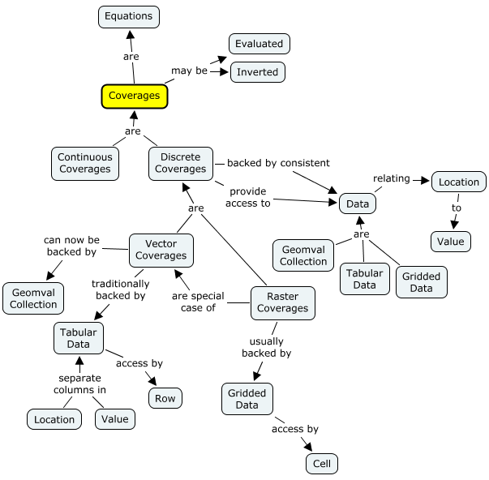
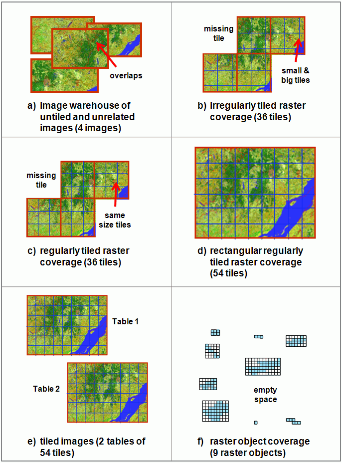

PostGIS Raster has three related representations that are easy to confuse:

* The PostgreSQL `raster` type is a variable-length value declared in
  `raster/rt_pg/rtpostgis.sql.in`. Its SQL input and output functions accept
  and emit HexWKB.
* The in-memory core object is `struct rt_raster_t`, with one or more
  `rt_band_t` entries owned by the raster.
* The on-disk PostgreSQL value is the serialized form built by
  `rt_raster_serialize()` and read by `rt_raster_deserialize()`.

Early design records describe prior versions of those formats. They are useful
as implementation history, but current work should start from the source files
named below.

## Coverage Model And Table Arrangements

A coverage is a mapping from a domain, usually locations and sometimes time, to
a consistent range of values. Conceptually it provides an evaluation operation:

```text
value = evaluate(location [, time])
```

Some coverages also support an inverse operation, such as returning an isotherm
for a requested temperature. The mapping is separate from its storage: it may
be calculated, interpolated from observations, stored as geometry/value rows,
or stored as cells in one or more rasters.



### Continuous And Discrete Coverages

A continuous coverage can calculate a value for every location. Solar elevation
as a function of location and time is one example. An interpolated temperature
surface is another: the observations are discrete, but an interpolation method
such as inverse-distance weighting evaluates locations between weather
stations. In PostGIS this model can be expressed as a function over a geometry
and, where needed, a timestamp.

A discrete coverage is backed by a collection whose values change at item or
cell boundaries. It commonly needs operations equivalent to finding the nearest
item, selecting items in a region, and listing the collection. Vector tables
and rasters are different representations of this model; the coverage is the
mapping and access contract, not merely the table or raster value that stores
its observations.

### Table-Backed Vector Coverages

A table can back a vector coverage when one geometry column supplies the domain
and one or more other columns supply the range. Each row associates the entire
geometry with that row's selected values. The same table can therefore support
different coverages by choosing different range columns. If the table has more
than one geometry column, the coverage must explicitly choose the domain
column.

The vector range need not be numeric or primitive: it can include text or
another spatial value. It must still have a consistent meaning and type wherever
the coverage is defined.

This row relationship cannot associate different array elements or attributes
with separate parts of one geometry. Such associations need separate rows or a
more explicit value type.

### Raster Coverage Semantics

A raster uses its grid and georeference to associate cell locations with one or
more numeric band values. This has several consequences that differ from a
geometry column:

1. One raster value contains many location/value associations. Other columns in
   the same row describe the raster as a whole; they do not attach separate
   values to its individual cells.
2. A PostgreSQL `raster` column alone does not guarantee that different rows
   have compatible SRIDs, alignment, dimensions, band counts, pixel types, or
   NODATA conventions. A logical tiled coverage must enforce the invariants it
   requires through constraints and controlled loading.
3. Rendering or analysing a raster coverage uses the raster bands. Other row
   columns can identify, group, or filter images and tiles, but are not bands in
   the rendered coverage.
4. A table-level lookup is normally two-stage: use the raster hull and spatial
   index to find candidate rows, then inspect the relevant cells and bands in
   those raster values.

A coverage may fit in one raster value and need no table-level tiling. A table
may also legitimately index unrelated rasters, but that does not make all rows
one coverage.

### Geometry/Value Collections

The `geomval` composite type makes one geometry and one numeric value
association explicit. `ST_DumpAsPolygons` returns `geomval` rows by grouping
same-valued raster cells into polygons. Those geometries can participate in
ordinary vector operations, but polygonizing many cells is expensive, so
queries should first restrict the raster rows and cells that need conversion.

A raster column does not by itself say how rows relate to each other. The rows
may be unrelated images, tiles of one logical coverage, separate tiled images,
or rasterized spatial objects.



The table arrangement determines which invariants matter:

* An image warehouse permits unrelated extents, dimensions, alignments, and
  overlaps.
* An irregular tiled coverage permits gaps and variable tile dimensions while
  treating non-overlapping rows as one logical layer.
* A regular tiled coverage shares alignment and tile dimensions without
  overlap; a rectangular regular coverage also fills its extent without gaps.
* Separate tiled images preserve image identity in separate tables or
  partitions even when each image is internally regular.
* A raster-object coverage stores rasterized features whose dimensions and
  extents may differ or overlap.

Current PostGIS records common SRID, scale, alignment, band, extent, and
regular-blocking properties through raster constraints and `raster_columns`.
Applications still need to define any stronger relationship between rows.

## Serialized PostgreSQL Value

`struct rt_raster_serialized_t` in `raster/rt_core/librtcore.h` is the fixed
header copied into the PostgreSQL varlena value. It stores the PostgreSQL size,
format version, band count, affine georeferencing coefficients, SRID, width,
and height.

After the header, `rt_raster_serialize()` writes each band as:

* one byte combining pixel type and band flags such as out-db, has-nodata, and
  is-nodata;
* padding to the pixel-type width used by the serialized form;
* the nodata value encoded in the band's pixel type;
* either the in-db pixel data or an out-db band number plus null-terminated
  path;
* trailing padding to the next eight-byte boundary.

`rt_raster_deserialize()` reads the same layout. It can also read only the
header, which is used by code paths that need dimensions or georeferencing
without touching all band data.

## WKB And HexWKB

`raster_in` and `raster_out`, implemented by `RASTER_in` and `RASTER_out` in
`raster/rt_pg/rtpg_inout.c`, use HexWKB for the SQL type's textual input and
output. `ST_AsWKB`, `ST_AsBinary`, `ST_AsHexWKB`, `ST_RastFromWKB`, and
`ST_RastFromHexWKB` are implemented through `raster/rt_pg/rtpg_wkb.c`.

The WKB reader and writer live in `raster/rt_core/rt_wkb.c`. WKB starts with an
endianness byte and version number, then writes the raster header fields from
band count through dimensions. Bands then carry the same pixel type, nodata,
out-db, and pixel-data concepts as the serialized value, but WKB does not use
the PostgreSQL varlena size field or the serialized-form padding.

The current WKB version accepted by `rt_raster_from_wkb()` is version 0. Any
change to these fields is a storage and wire-format compatibility change, so it
must be reviewed with upgrade behavior, regression fixtures, and external
clients in mind.

## Out-Db Bands

Out-db bands are bands whose pixels are read from a filesystem path rather than
stored inline in the PostgreSQL value. In the core band struct, those bands use
`rt_extband_t` with a zero-based source band number and path. SQL-visible
helpers such as `ST_BandPath`, `ST_BandFileSize`, `ST_BandFileTimestamp`, and
`ST_SetBandPath` live in `raster/rt_pg/rtpg_band_properties.c`.

Because an out-db path is data inside the raster value, code that serializes,
copies, tiles, or converts rasters must preserve whether each band is in-db or
out-db. Server-side access is also governed by the raster GDAL configuration
described in [PostGIS Raster and the GDAL driver](raster-gdal-driver.md).

## Raster Catalogs

`raster_columns` and `raster_overviews` are SQL views built from PostgreSQL
catalogs and PostGIS raster constraints. The durable metadata contract for
clients is the current SQL in `raster/rt_pg/rtpostgis.sql.in` plus the user
manual sections for raster catalogs, constraints, and overviews.

The old specification pages listed beta-era loader flags, prototype Python
scripts, and planned catalog tables. Current loader behavior belongs to
`raster/loader/raster2pgsql.c`, and current user-facing behavior belongs to the
raster manual.
